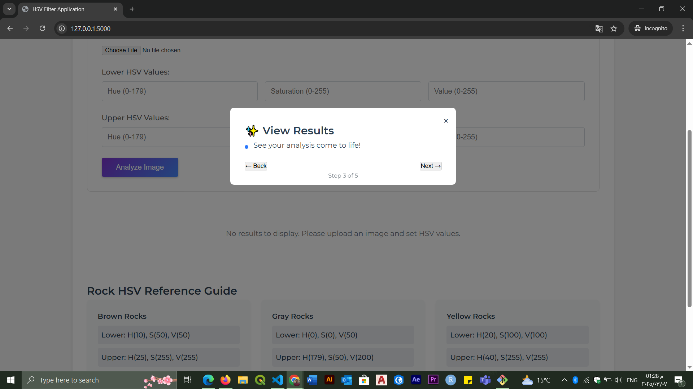

# HSV Filter App

## Overview
The **HSV Filter App** is an advanced image analysis tool that allows users to fine-tune HSV color detection parameters and analyze images effectively. The app provides a seamless onboarding experience through an interactive step-by-step guide.

## Features
- 🚀 **Step-by-step onboarding modal** to guide new users.
- 📷 **Image upload functionality** for real-time HSV filtering.
- 🌈 **Customizable HSV parameters** for precise color detection.
- ✨ **Instant result visualization** to see filtered images immediately.
- 📚 **Rock reference guide** for geology-based applications.

## Installation
1. Clone the repository:
   ```sh
   git clone https://github.com/ghonim0007/HSV_Filter_App.git
   ```
2. Navigate to the project directory:
   ```sh
   cd HSV_Filter_App
   ```
3. Install dependencies:
   ```sh
   pip install -r requirements.txt
   ```
4. Run the application:
   ```sh
   python app.py
   ```
5. Open your browser and visit:
   ```sh
   http://127.0.0.1:5000
   ```

## User Guide
### Step-by-Step Onboarding
The app includes an interactive onboarding tour to help users get started:

#### Step 1: Welcome

- Introduction to the application and its capabilities.
- Users can proceed to the next step or skip the tour.

#### Step 2: Upload Your Image

- Allows users to upload an image for analysis.

#### Step 3: Set HSV Values

- Users can fine-tune HSV values to adjust color filtering.

#### Step 4: View Results

- Displays the processed image with applied HSV filters.

#### Step 5: Rock Reference Guide

- Provides geological reference information for rock classification.

## Contribution
Contributions are welcome! Follow these steps to contribute:
1. Fork the repository.
2. Create a new branch: `git checkout -b feature-branch`.
3. Make your changes and commit: `git commit -m "Add new feature"`.
4. Push to the branch: `git push origin feature-branch`.
5. Open a Pull Request.

## License
This project is licensed under the MIT License.

---

For any issues or feature requests, feel free to open an issue on the [GitHub repository](https://github.com/ghonim0007/HSV_Filter_App/issues).

