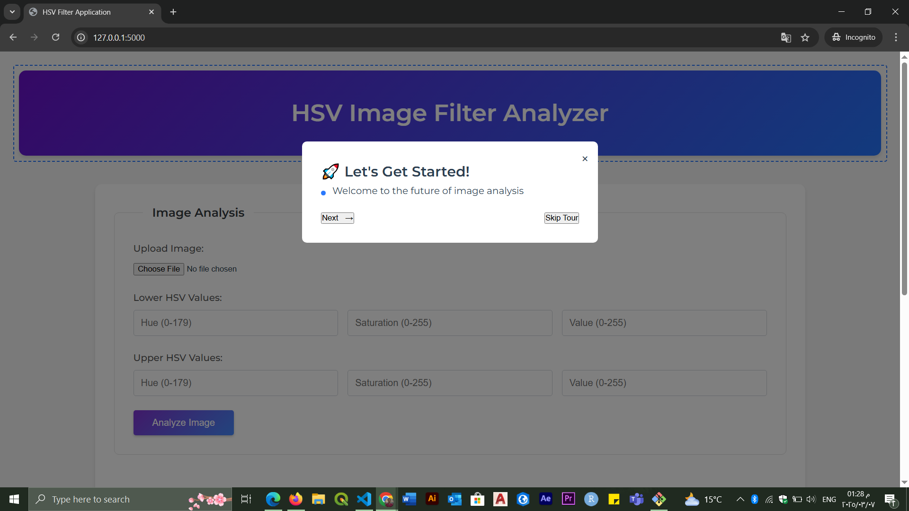
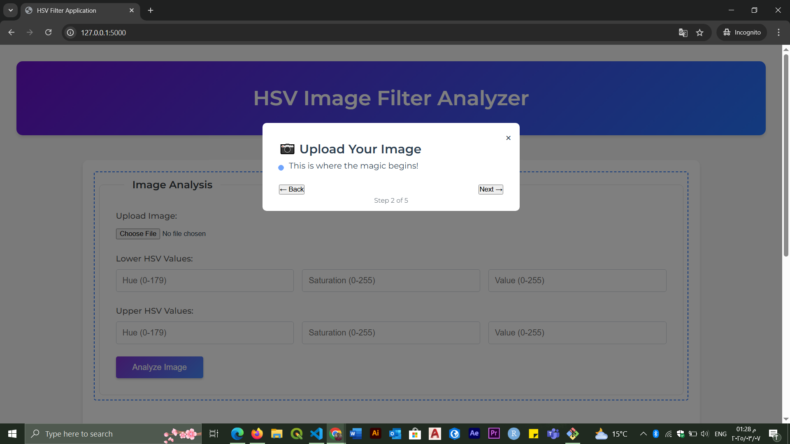
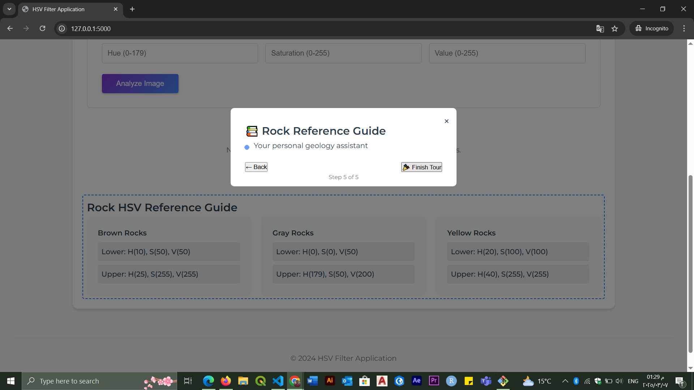
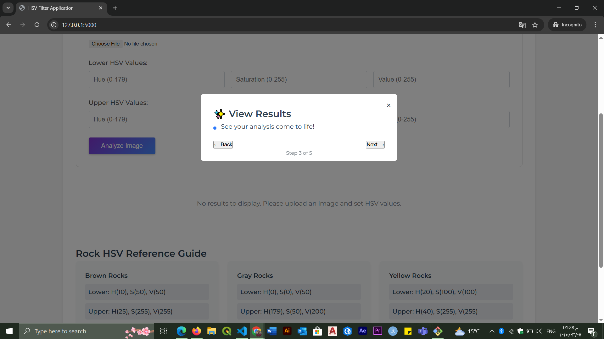
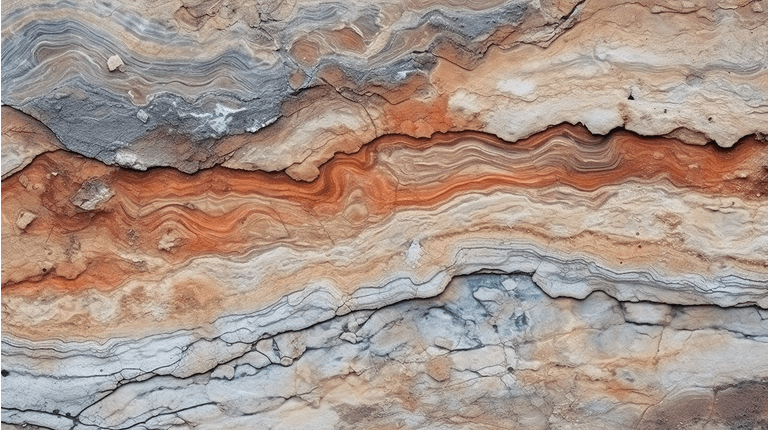

# HSV Filter Web App

## 🎨 About the Project
HSV Filter Web App is an interactive web application designed for analyzing images using the HSV (Hue, Saturation, Value) color space. The app provides a user-friendly interface to upload images, adjust HSV values, and visualize the filtered results.

## ✨ Features
- 📷 **Upload Images**: Users can upload their own images for analysis.
- 🌈 **Adjust HSV Values**: Fine-tune the hue, saturation, and value parameters to detect specific colors.
- 🖼 **Real-time Filtering**: Instantly preview the results as you adjust settings.
- 📚 **Rock Reference Guide**: Integrated guide for geological analysis.

## 🚀 How to Use
### Step 1: Getting Started
Welcome to the future of image analysis! Click **Next** to begin.

### Step 2: Upload Your Image
Upload an image to start the analysis.

### Step 3: Set HSV Values
Adjust the HSV values to fine-tune the color detection.

### Step 4: View Results
See your analysis results in real-time.

### Step 5: Rock Reference Guide
Use the integrated reference guide for geology-related insights.

### 🎉 Final Result
Here is an example of the final output of the analysis:

## 🛠 Technologies Used
- **Frontend**: HTML, CSS, JavaScript
- **Backend**: Python (Flask)
- **Libraries**: OpenCV for image processing

## 📌 Future Enhancements
- 🔄 Improve the accuracy of HSV filtering
- 📊 Add support for additional image processing techniques
- 🌍 Enable multi-language support

## 📬 Contact
For any inquiries or feature requests, feel free to reach out via GitHub Issues!

---
🚀 Happy Image Processing!

